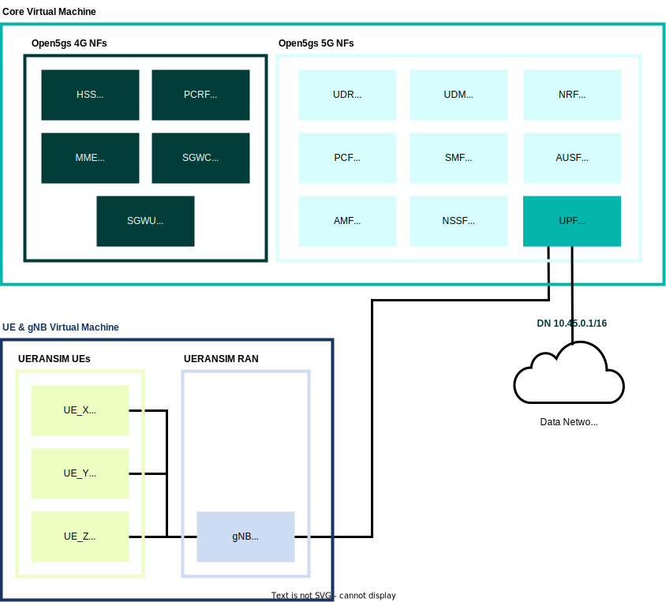

# Open5gs config files

To put all config files, restart service and update subscriber data if necesary run the following:

```console
user@core:$ put_open5gs_configs.sh <MEC/Double_upf/Classic_Core> 
```

Below is an example of putting the Double_upf configs:


## Setups

There are multiple setups that you can use.

### Examples:

Classic_Core (the simplist):


