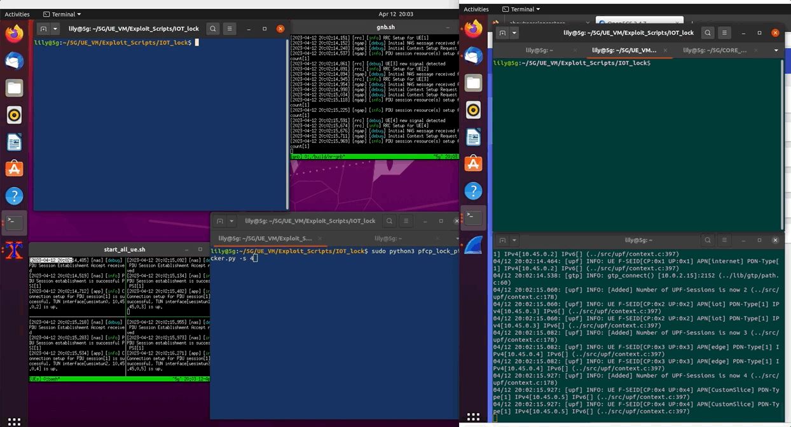

# IOT Lock
A hypothetical system has an IOT lock. The lock works in the way that it gets a User_ID and Password from the person trying to enter, sends that data to the Lock server which decides if the user should be allowed in or not.

## Normal Lock Function

## Lock Picked with PFCP

