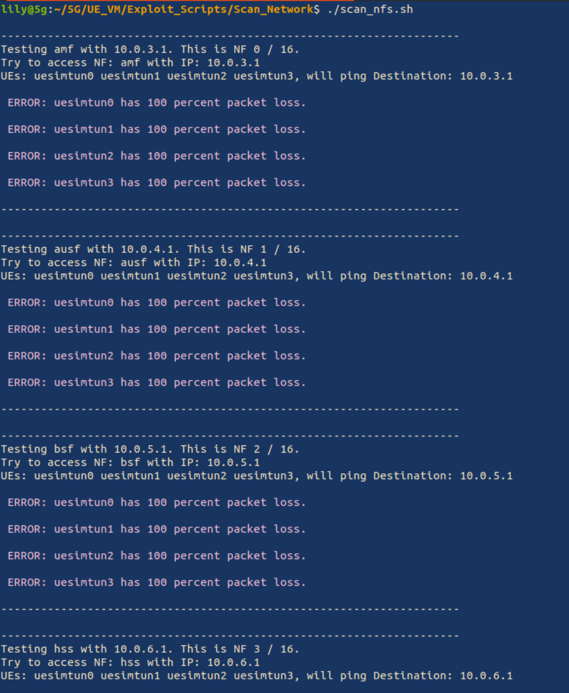

# Scan Network

Once you have any setup of UEs (uesimtun) setup, (here we assume that you are using uesimtun0-3 but this can be changed in the -u paramerter in scan_nfs.sh.) we want to see if we can access the individal network functions from the UEs. We can scan a single network function as such.

``` console
user@5g:~/5G/UE_VM/Exploit_Scripts/Scan_Network$  ./scan_nf.sh <IP of NF> <Optional Name>

```

If we want to scan all the NFs that we know of we can use ./scan\_nfs.sh. Some of the NFs might not be on in some configurations. For example upf2 will not be running in the Classic\_Core setup so should never be reachable when running in the mode Classic\_Core.

``` console
user@5g:~/5G/UE_VM/Exploit_Scripts/Scan_Network$  ./scan_nfs.sh
```

## Reachability

If you get a response or not depends on the routing configuration of the core. A safe routing configuration would block the forwarded requests from the UE's. If so you would get a response that looks like this when running ./scan\_nfs.sh.



However if the connection is not blocked you would get a result such as this:

#TODO screenshot 2

If you do have connection to these devices you can try the next steps of scanning, brutforceing or DOS'ing. #TODO 


To see what commands are used to allow/disallow this connection please refer to #todo core vm section link.


